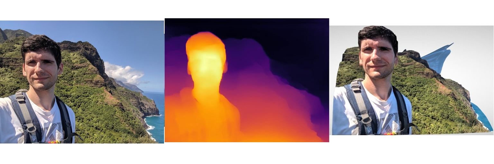

Currently this holds two semi-related projects of mine:
 - 1. Using an already trained MegaDepth model to turn a photo into a textured 2.5D surface.
 - 2. Viewing a USGS pointcloud of D.C., textured using a NAIP image.

After testing MegaDepth on aerial images, I've seen it doesn't do well. That's to be expected,
as the dataset had few (if any) aerial images.

I chose to use glTF for representing the 3d stuff, since it's more portable and so I had a reason to work more on a Python exporter I started a while back.

When I get some time I want to finetune a model on aerial data. I can use NAIP images for the images, and the pointclouds to get the depth (rasterize by projecting out Z axis and sampling).
This assumes that satellite images are perfectly orthographic and zero-nadir, which is not the case, but I think it will be good enough.
I think there are already datasets for this exact single-view aerial depth estimation so I need to search for that them too.
For this to be applicable in the real-world, I'll want to take into account focal length and altitude and actually output measurements in meters. I remeber reading a paper a few years back that was similar to megadepth, but it took sparse depth measurements and trained a CNN to inpaint the rest of the depth values. This approach is probably better suited than megadepth. 
